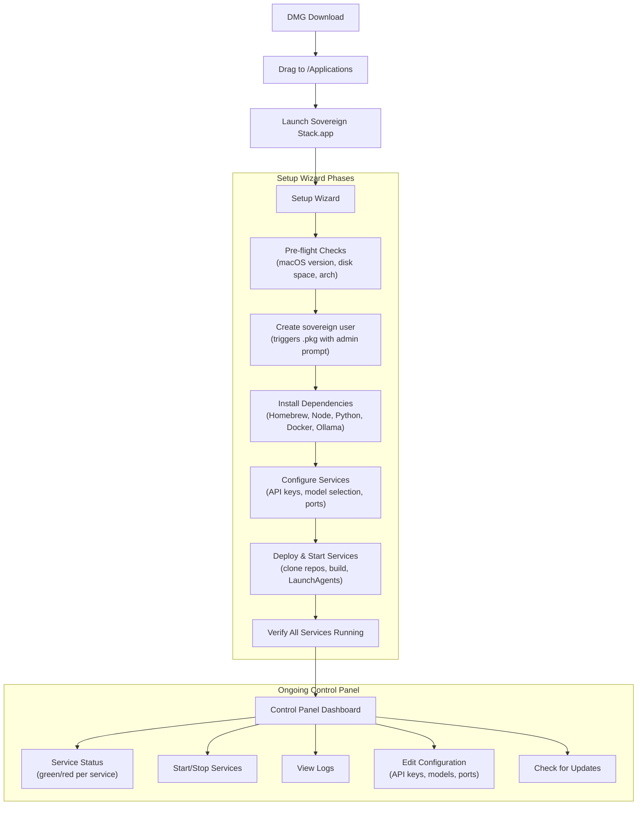
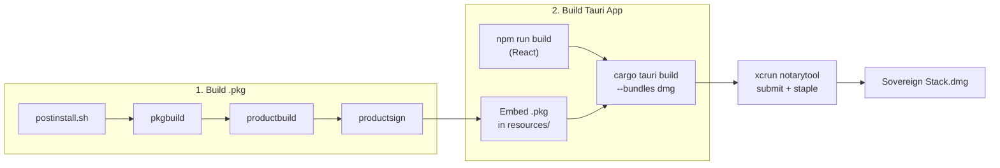

# Sovereign Stack DMG Packaging Plan

## The Problem

The Sovereign Stack currently requires a manual 12-phase setup process ([sovereign-stack-setup-guide.md](sovereign-stack-setup-guide.md)) involving ~100 terminal commands across two user accounts. Packaging this as a DMG means turning that into something a user can double-click.

## The Four Approaches -- Analyzed

### Option A: Script-Only DMG (drag-to-install scripts + docs)

**What it is**: A DMG containing `setup.sh`, config files, docs, and a README saying "run this script."

- **Security**: LOW. Shell scripts running with broad permissions. No sandboxing. Users must trust and run arbitrary scripts. No code signing or notarization (scripts aren't apps).
- **Scalability**: LOW. Every new feature means editing bash scripts. No UI for configuration. Error handling is primitive (exit codes and echo).
- **Ease of setup**: MEDIUM for technical users, IMPOSSIBLE for non-technical. Still requires terminal.
- **Build effort**: ~1-2 days. Just reorganize existing scripts.
- **Verdict**: Fine for personal disaster recovery. Not distributable.

### Option B: .pkg Installer (macOS native installer package)

**What it is**: A signed .pkg file with preflight/postinstall scripts that run with root privileges via the macOS Installer.app.

- **Security**: HIGH. Apple's Installer.app handles privilege escalation with a single admin password prompt. Postinstall scripts run as root, so they can create the `sovereign` user, set permissions, install LaunchAgents. Code-signed and notarizable.
- **Scalability**: LOW-MEDIUM. No runtime UI. Install-and-forget. Updates require building a new .pkg. No service management after install.
- **Ease of setup**: HIGH for the install itself (double-click, enter password, done). But no ongoing management UI -- users still need terminal for service control, API key changes, troubleshooting.
- **Build effort**: ~3-5 days. Need `pkgbuild`/`productbuild`, signing certs, postinstall scripts.
- **Verdict**: Great for the one-time privileged setup (user creation, OS hardening). Bad as the only deliverable.

### Option C: Tauri Control Panel App in a DMG

**What it is**: A lightweight native macOS app (Rust backend + web frontend) that acts as a setup wizard AND ongoing control panel. Delivered as a .app inside a DMG. Uses Tauri's sidecar feature to embed binaries (Ollama, etc.).

- **Security**: HIGH. macOS app sandbox. Code-signed and notarized. Privileged operations via `SMAppService` (macOS 13+) or `osascript` admin prompts -- explicit, auditable, user-approved. No blanket root access. Tauri's Rust backend is memory-safe. API keys entered in the app UI, stored in macOS Keychain.
- **Scalability**: HIGH. Full UI for service management, status monitoring, configuration. Auto-update via Tauri's updater plugin. New features = new UI screens. Can embed sidecar binaries for dependencies.
- **Ease of setup**: HIGH. Drag app to /Applications. Open it. Step-by-step wizard with progress bars. Non-technical users never see a terminal.
- **Build effort**: ~2-4 weeks for v1. Rust + TypeScript. But the result is a real product.
- **Verdict**: Best balance of security, UX, and scalability. This is the recommendation.

### Option D: Full Self-Contained Bundle (everything embedded)

**What it is**: Option C but with Node.js, Python, Docker, Ollama, and all service code bundled inside the .app.

- **Security**: MEDIUM. Bundled runtimes can't be independently updated by the OS. If a vulnerability is found in the bundled Node.js, you must ship an app update. Larger attack surface.
- **Scalability**: MEDIUM. Massive app bundle (~5-10GB with models). Updates are huge. Version conflicts with user-installed tools.
- **Ease of setup**: HIGHEST. Zero prerequisites. But download size is enormous.
- **Build effort**: ~4-6 weeks. Complex build pipeline. Must maintain bundled runtime versions.
- **Verdict**: Maximum convenience but maintenance nightmare. Docker alone can't be meaningfully bundled (it needs a VM/hypervisor). Ollama models are 20GB+. Diminishing returns.

---

## Recommendation: Option C (Tauri App) + Option B (.pkg) Hybrid

The optimal approach is a **Tauri control panel app** that uses an **embedded .pkg** for the one-time privileged setup. This gives you:

- **Best security**: App sandbox + explicit privilege escalation only when needed
- **Best UX**: Visual setup wizard + ongoing service dashboard
- **Best scalability**: Ship updates via Tauri updater, add features as UI screens
- **Broadest audience**: Works for you, technical users, and non-technical users




---

## Architecture

### Tech Stack

- **App shell**: Tauri 2.0 (Rust backend, ~3MB binary vs Electron's ~150MB)
- **Frontend**: React + TypeScript + Tailwind (reuse Sovereign design system)
- **Privileged installer**: Embedded .pkg built with `pkgbuild` (for user creation, OS hardening)
- **Service management**: Rust backend calls `launchctl`, reads service logs, checks ports
- **Secrets**: macOS Keychain via `security` CLI or Tauri keychain plugin
- **Sidecar binaries**: Ollama binary embedded; Homebrew/Node/Python/Docker installed via the wizard
- **Auto-update**: Tauri updater plugin with a GitHub Releases backend

### Project Structure

```
sovereign-stack-app/
  src-tauri/
    src/
      main.rs              # Tauri app entry
      commands/
        setup.rs           # Setup wizard backend commands
        services.rs        # Service start/stop/status
        config.rs          # Read/write config, keychain
        system.rs          # OS checks, privilege escalation
    resources/
      sovereign-setup.pkg  # Pre-built .pkg for privileged ops
    Cargo.toml
    tauri.conf.json        # Bundle config, sidecar defs, DMG settings
  src/
    App.tsx
    pages/
      SetupWizard.tsx      # Multi-step setup flow
      Dashboard.tsx        # Service status + controls
      Logs.tsx             # Log viewer
      Settings.tsx         # Config editor
    components/            # Sovereign design system components
  package.json
  build-pkg.sh            # Script to build the embedded .pkg
  build-dmg.sh            # Orchestrates full build pipeline
```

### Key Security Decisions

- The Tauri app runs as the admin user (barney2-equivalent). It never runs as root.
- The .pkg is invoked ONCE during setup for operations that need root: creating the `sovereign` user, setting directory permissions, installing LaunchDaemons. After that, it's never needed again.
- API keys are stored in macOS Keychain, not in .env files on disk. The app injects them into service plists at launch time.
- The app is code-signed with a Developer ID and notarized with Apple. Gatekeeper will verify it on first launch.
- Service communication stays on localhost. The app verifies this and warns if any service binds to 0.0.0.0.

### What the .pkg Postinstall Script Handles (root-required operations)

1. Create `sovereign` user via `sysadminctl`
2. Create `/Users/sovereign/sovereign-stack/` directory tree with correct ownership
3. Set up `/Users/Shared/sovereign-deploy/` bridge directory
4. Configure macOS power settings (`pmset`)
5. Enable firewall + stealth mode
6. Disable mDNS advertising
7. Install system-level LaunchDaemons (if any)

### What the Tauri App Handles (no root needed)

1. Install Homebrew (user-level, no sudo needed on modern macOS)
2. Install Node, Python, Docker Desktop, Ollama, Tailscale via `brew`
3. Clone NanoClaw, memU repos
4. Build NanoClaw (`npm run build`)
5. Configure all services (write configs, inject API keys)
6. Install LaunchAgents (user-level, into `~/Library/LaunchAgents/`)
7. Start/stop/restart services via `launchctl`
8. Monitor service health (port checks, log tailing)
9. Pull Ollama models with progress indication
10. Run the deploy/install cycle (replaces manual `deploy.sh` + `install.sh`)

---

## Build Pipeline




### Build commands (approximate)

```bash
# 1. Build the privileged installer .pkg
pkgbuild --nopayload --scripts pkg-scripts/ \
  --identifier com.sovereign.setup --version 1.0 \
  sovereign-setup-component.pkg

productbuild --package sovereign-setup-component.pkg \
  sovereign-setup.pkg

productsign --sign "Developer ID Installer: ..." \
  sovereign-setup.pkg src-tauri/resources/sovereign-setup.pkg

# 2. Build the Tauri app + DMG
npm run tauri build -- --bundles dmg

# 3. Notarize
xcrun notarytool submit "Sovereign Stack.dmg" \
  --apple-id "..." --team-id "..." --password "..."
xcrun stapler staple "Sovereign Stack.dmg"
```

---

## What Needs to Happen (Implementation Phases)

### Phase 1: Foundation (~1 week)

- Initialize Tauri 2.0 project with React frontend
- Set up the Rust command layer (Tauri IPC)
- Build the privileged .pkg with postinstall script for user creation + OS hardening
- Implement pre-flight checks (macOS version, architecture, disk space)

### Phase 2: Setup Wizard (~1 week)

- Multi-step wizard UI (React) with progress tracking
- Homebrew + dependency installation commands (Rust -> shell)
- Repo cloning + service configuration
- API key input -> Keychain storage
- Ollama model pulling with progress bars

### Phase 3: Control Panel Dashboard (~1 week)

- Service status grid (port checks, process checks)
- Start/stop/restart controls via `launchctl`
- Log viewer (tail service log files)
- Configuration editor (API keys, model selection, ports)

### Phase 4: Polish + Distribution (~1 week)

- Code signing (Developer ID Application + Installer certificates)
- Notarization pipeline
- DMG customization (background image, icon layout)
- Auto-update mechanism via Tauri updater
- Error handling, edge cases, retry logic

---

## Prerequisites Before Building

1. **Apple Developer Program membership** ($99/year) -- required for code signing and notarization
2. **Developer ID Application certificate** -- for signing the .app
3. **Developer ID Installer certificate** -- for signing the .pkg
4. **Rust toolchain** -- `rustup` with stable channel
5. **Tauri CLI** -- `cargo install tauri-cli`
6. **Node.js 22** -- for the React frontend build

---

## What This Does NOT Solve

- **Docker Desktop** cannot be bundled or silently installed. The wizard will download and prompt the user to install it. This is a macOS limitation (Docker Desktop requires a hypervisor entitlement).
- **Ollama models** are not bundled. Only `nomic-embed-text` (274MB) is needed for the current stack. The wizard downloads it during setup with a progress bar.
- **Claude Max subscription** is external. The wizard explains this and links to signup.

## Current Service Stack (as of Session 8)

The Tauri app must manage these services — no others:


| Service         | Port  | Runtime          | Purpose                                          |
| --------------- | ----- | ---------------- | ------------------------------------------------ |
| NanoClaw (Bizo) | N/A   | Node.js process  | Agent brain, WhatsApp interface                  |
| LiteLLM         | 4000  | Python process   | Model routing proxy (5 tiers, all Anthropic API) |
| Ollama          | 11434 | Native binary    | Local inference (nomic-embed-text only)          |
| memU            | 8090  | Python/uvicorn   | Semantic memory API                              |
| PostgreSQL      | 5432  | Docker container | memU storage                                     |
| Temporal        | 7233  | Docker container | memU workflow engine                             |
| AnythingLLM     | 3001  | Docker container | RAG / knowledge base                             |


Key constraints:

- Docker Desktop runs under the admin user (barney2-equivalent). The `sovereign` user accesses it via `DOCKER_HOST` env var + socket chmod.
- `docker-compose` (standalone binary) must be used, not `docker compose` (plugin) — the plugin isn't available to the sovereign user.
- Large local models (32B+) are not viable on 16GB hardware. All LLM inference routes through LiteLLM to Anthropic API.
- The two-user permission model (admin + sovereign) is the most common source of bugs. The app must handle this correctly.

